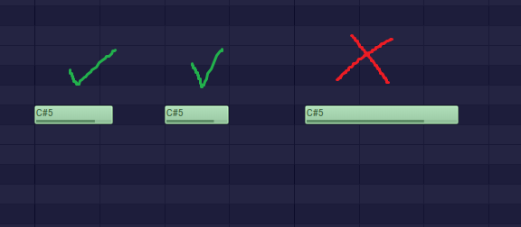

# midi to bitsy
there should be 16 notes in a bar you can make 1 note as long as an entire bar. make sure the note lengths are quantized by quantizing or snapping

 if your midi file has a chord the other note would be deleted from it to make it a single note chord. add a main melody to get data or add another midi file to bass/counter melody to get both data. When you click display data, go to bitsy and create a new tune and right under TUNE(a number or letter) paste the data under it then in bitsy you can change the name/tempo/pusle waves 

the maximum number of bars in bitsy is 16 
look at the demonstration midi as an example of what you can do. make sure you dont make long notes pass over from one bar into another bar

do not have overlapping notes like this it will mess up the note positions

